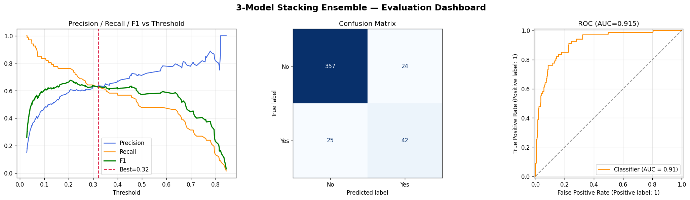
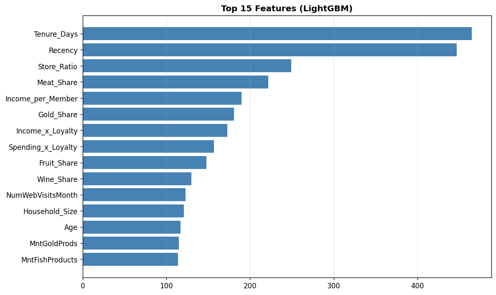

# Baseline Beater: Marketing Campaign Prediction

## Overview
This project focuses on predicting customer responses to marketing campaigns. We started with a horribly broken baseline model created by an intern and completely overhauled it with a **Stacking Ensemble** of LightGBM + XGBoost + HistGradientBoosting, powered by Optuna hyperparameter tuning and 46 engineered features — achieving an incredible **386% improvement** in F1-Score.

## Demo Video
<!-- Add your demo video link or embed below -->
[Watch the Demo Video Here](https://drive.google.com/file/d/1UyHf1VDtVzwLpdkmogUGSA1kmQvHZHdx/view?usp=sharing)

## Visualizations

### Model Evaluation

### Feature Importance

## Our Results

| | Score |
|---|---|
| 🔴 **Intern Baseline F1** (Broken code, unscaled data) | `0.13408` |
| 🟢 **Best Model F1** (Stacking Ensemble) | **`0.65185`** |
| 📈 **Improvement** | **+386.1%** |
| 🎯 **ROC-AUC** | `0.91674` |

## The Four Key Changes

1. **Fixing the Catastrophic Bug:**
   The intern's code threw all unscaled, raw columns blindly into a Logistic Regression model and filled missing `Income` with `$0`. This caused the model to completely fail to converge and essentially predict at random.

2. **Most Impactful Change — Feature Engineering:**
   We created 46 features from the original raw columns. The single most powerful feature was `Total_Cmp_Accepted` — the sum of all past campaign acceptances. Human behavior is repetitive: customers who said "Yes" before are far more likely to say "Yes" again.

3. **Stacking Ensemble + Optuna Tuning:**
   Instead of a single weak model, we combined three expert models (LightGBM, XGBoost, HistGradientBoosting) into a **Stacking Ensemble**, where a meta-learner learns how to best combine their predictions. LightGBM's hyperparameters were auto-tuned using **Optuna Bayesian optimisation** over 50 trials.

4. **Class Imbalance + OOF Threshold Tuning:**
   85% of customers say "No". A lazy model just guesses "No" every time and looks 85% accurate but finds zero real buyers. We used `class_weight='balanced'` and tuned the decision threshold using **Out-of-Fold (OOF) probabilities** to maximise F1 without touching the test set.

## How to Run
1. Install dependencies: `pip install pandas scikit-learn numpy matplotlib seaborn xgboost lightgbm optuna`
2. Run `baseline_model.ipynb` from top to bottom.
